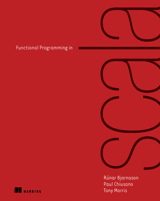
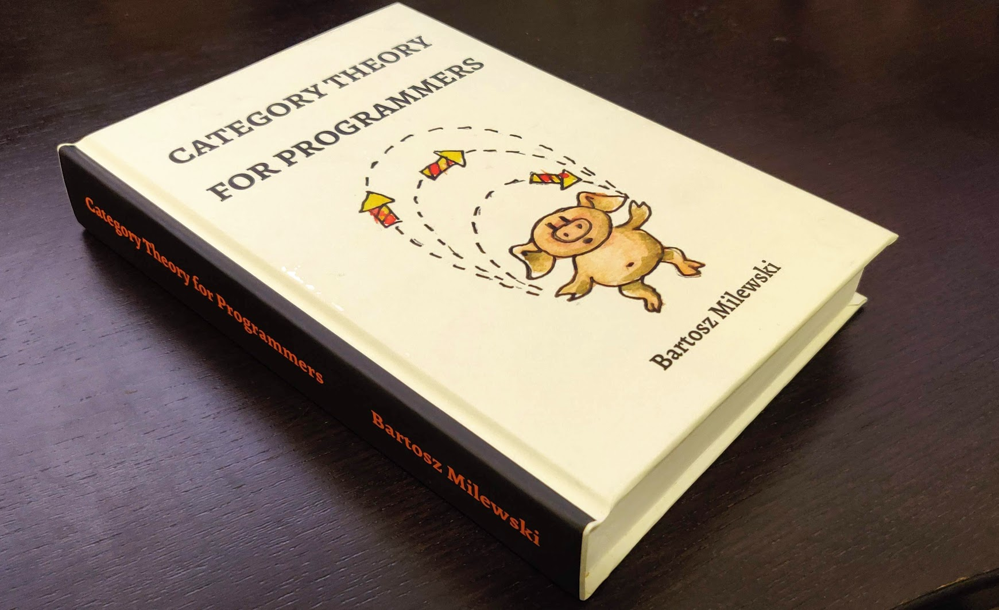

# The story so far

:::incremental

* What are type classes?
* Build a set of rules a type.
* Enable ad-hoc polymorphism
* In Scala: Context aware & able to augment existing types

:::

# A brief detour

Having a hierarchy C extends B extends A which one is the most:

* powerful
* the highest abstraction

> Rule Of Least Power
 - When designing computer systems, one is often faced with a choice between using a more or less powerful language for publishing information, for expressing constraints, or for solving some problem. This finding explores tradeoffs relating the choice of language to reusability of information. The "Rule of Least Power" suggests choosing the least powerful language suitable for a given purpose.

# Functional Programming in Scala

[{ height="520" }](https://www.manning.com/books/functional-programming-in-scala)

# Теория на категориите

[{ height="520" }](https://github.com/hmemcpy/milewski-ctfp-pdf)
