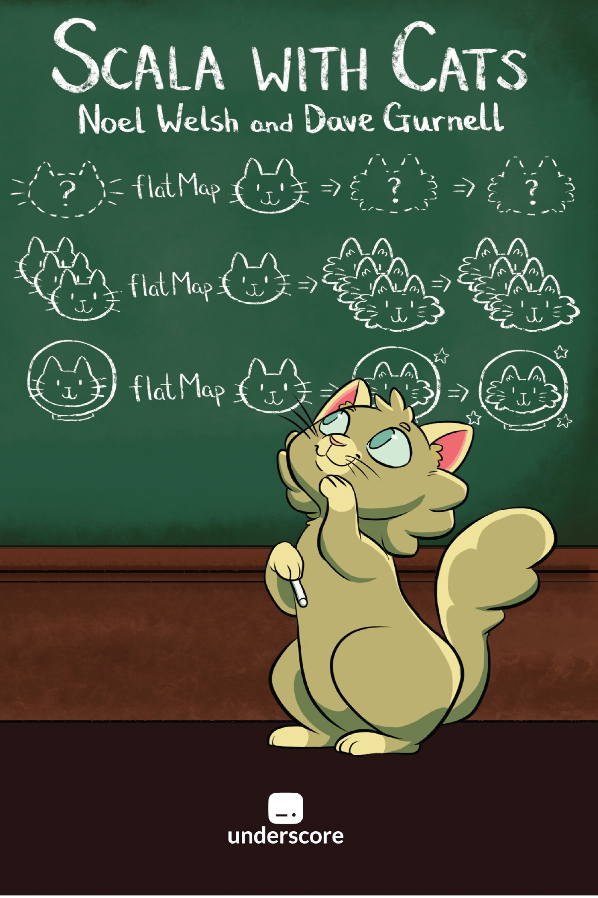
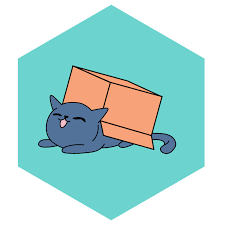
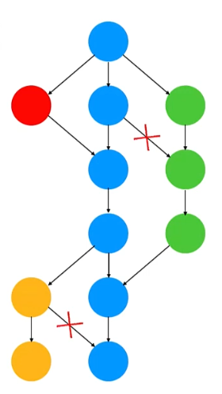
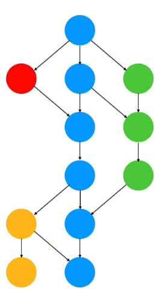

#

[{ width=520 }](https://typelevel.org/projects/)

# Cats { height=64 style="vertical-align: middle" }

[](https://typelevel.org/cats/)

# Cats Book

[{ height=520 }](https://www.scalawithcats.com/)

# Cats

Предоставя:

* [Type class-ове](https://typelevel.org/cats/typeclasses.html)
* Инстанции на тези type class-ове
* [Синтаксис](https://typelevel.org/cats/nomenclature.html) (предимно под формата на extension методи)
* [Data types](https://typelevel.org/cats/datatypes.html)
* [тестване на аксиоми](https://typelevel.org/cats/typeclasses/lawtesting.html)

# Data types

* [Chain](https://typelevel.org/cats/datatypes/chain.html)
* [Validated](https://typelevel.org/cats/datatypes/validated.html)
* [Ior](https://typelevel.org/cats/datatypes/ior.html)
* [Kleisli](https://typelevel.org/cats/datatypes/kleisli.html)
* [Id монада](https://typelevel.org/cats/datatypes/id.html)
* [State монада](https://typelevel.org/cats/datatypes/state.html)
* `FunctionK` (a.k.a. `~>`), `Nested`, `Free` –<br />ще разгледаме допълнително
* ...

# Синтаксис

# Синтаксис – Option

```scala
import cats.syntax.option.*

val maybeOne = 1.some // Some(1): Option[Int]
val maybeN = none[Int] // None: Option[Int]

val either = maybeOne.toRightNec("It's not there :(") // Right(1): Either[String, Int]
val validated = maybeOne.toValidNec("It's not there :(") // Left("..."): Either[String, Int]

val integer = maybeN.orEmpty // 0
```

# Синтаксис – Either и Validated

::: { .fragment }

```scala
import cats.syntax.either.*

val eitherOne = 1.asRight
val eitherN = "Error".asLeft

val eitherOneChain = 1.rightNec
val eitherNChain = "Error".leftNec

val recoveredEither = eitherN.recover {
  case "Error" => 42.asRight
}

eitherOneChain.toValidated
```

:::

::: { .fragment }

```scala
import cats.syntax.validated.*

val validatedOne = 1.validNec
val validatedN = "Error".invalidNec

validatedOne.toEither
```

:::

# Type class-ове

[Поглед над йеархиите](https://cdn.rawgit.com/tpolecat/cats-infographic/master/cats.svg)

# Type class-ове и синтаксис чрез implicit

::: { .fragment }

Да разгледаме отново дефинирането на Type Class-ове в [Scala 3](https://github.com/scala-fmi/scala-fmi-2022/tree/master/lectures/examples/09-type-classes/src/main/scala/math) и [Scala 2](https://github.com/scala-fmi/scala-fmi-2022/tree/master/lectures/examples/09-type-classes-scala-2/src/main/scala/math)

:::

::: incremental

* В Scala 3 инстанциите на type class-овете идват заедно с техния синтаксис (extension методи)
* В Scala 2 инстанциите и синтаксиса са разделени и е нужно да бъдат import-нати и двете
* Scala 2 използва `implicit` класове за extension методи
* В Scala 2 вместо `given` инстанции се използват `implicit` `val`-ове и `def`-ове
* В Scala 2 вместо `using` параметри се декларират `implicit` параметри
* Всичко останало работи по подобен начин
* Scala 3 позволява използване на `given`, където се очаква `implicit`, и използване на `implicit`, където се очаква `using`

:::

# Type class-ове и синтаксис чрез implicit

Cats използва изцяло Scala 2 синтаксиса за Type Class-ове (чрез `implicit`)

::: { .fragment }

[Cats Cheatsheet](../resources/cats-cheat-sheet.md)

:::

# Сравнение и наредба

::: { .fragment }

```scala
trait Eq[A]:
  def eqv(x: A, y: A): Boolean

  def neqv(x: A, y: A): Boolean = !eqv(x, y)
```

:::

# Semigroup и Monoid

```scala
trait Semigroup[A]:
  def combine(x: A, y: A): A
```
```scala
trait Monoid[A] extends Semigroup[A]:
  def empty: A
```

# Semigroup и Monoid синтаксис

```scala
import cats.syntax.monoid.*

1 |+| 2 // 3
"ab".combineN(3) // "ababab"

0.isEmpty // true

Semigroup[Int].combineAllOption(List(1, 2, 3)) // Some(6)
Monoid[Int].combineAll(List(1, 2, 3)) // 6
```

# Тестване на аксиоми

# Foldable

```scala
trait Foldable[F[_]]:
  def foldLeft[A, B](fa: F[A], b: B)(f: (B, A) => B): B
  def foldRight[A, B](fa: F[A], lb: Eval[B])(f: (A, Eval[B]) => Eval[B]): Eval[B]
```

#

* Функтор
* Апликатив
* Монада

# Functor

```scala
trait Functor[F[_]]:
  def map[A, B](fa: F[A])(f: A => B): F[B]
```

# Apply

```scala
trait Apply[F[_]] extends Functor[F]:
  def ap[A, B](ff: F[A => B])(fa: F[A]): F[B]
  
  def product[A, B](fa: F[A], fb: F[B]): F[(A, B)] =
    ap(map(fa)(a => (b: B) => (a, b)))(fb)

  def map2[A, B, Z](fa: F[A], fb: F[B])(f: (A, B) => Z): F[Z] =
    map(product(fa, fb))(f.tupled)
```

# Applicative

```scala
trait Applicative[F[_]] extends Apply[F]:
  def pure[A](x: A): F[A]

  def map[A, B](fa: F[A])(f: A => B): F[B] =
    ap(pure(f))(fa)
```

# Traverse

```scala
trait Traverse[F[_]] extends Functor[F] with Foldable[F]:
  def traverse[G[_] : Applicative, A, B](fa: F[A])(f: A => G[B]): G[F[B]]

  def sequence[G[_]: Applicative, A](fga: F[G[A]]): G[F[A]] =
    traverse(fga)(ga => ga)
```

# Apply, Applicative, Traverse синтаксис

# FlatMap

```scala
trait FlatMap[F[_]] extends Apply[F]:
  def flatMap[A, B](fa: F[A])(f: A => F[B]): F[B]
```

# Monad

```scala
trait Monad[F[_]] extends FlatMap[F] with Applicative[F]
```

# MonadError

```scala
trait MonadError[F[_], E] extends ApplicativeError[F, E] with Monad[F]
```

Абстрактни членове:

```scala
def raiseError[A](e: E): F[A]
def handleErrorWith[A](fa: F[A])(f: E => F[A]): F[A]
```

# FlatMap, Monad и MonadError синтаксис

# Parallel

::: { .fragment }

```scala
trait Parallel[M[_]] extends NonEmptyParallel[M]:
  type F[_]
  
  def applicative: Applicative[F]
  def monad: Monad[M]

  def sequential: F ~> M
  def parallel: M ~> F
```

:::

# Композиция на функтор, апликатив и монада

# Композиция на монади – `OptionT` и `EitherT`

::: { .fragment }

[EitherT от лекцията за ефекти](https://github.com/scala-fmi/scala-fmi-2021/blob/master/lectures/07-effects-and-functional-error-handling.ipynb)

:::

# Free Монада:

::: incremental

* позволява изграждането не езици и интерпретатори
* няма да го разглеждаме в курса
* повече на следните ресурси:
  - [Free as in Monads](https://www.youtube.com/watch?v=aKUQUIHRGec)
  - [Composable application architecture with reasonably priced monads](https://www.youtube.com/watch?v=M258zVn4m2M)
  - [Free Monads](https://www.youtube.com/watch?v=ycrpJrcWMp4)

:::

# Cats Effect



::: { .fragment }

> "Framework to build composable typesafe functional concurrency libraries and applications." -- Cats Effect

:::

# Cats Effect

::: incremental

* Type class-ове за конкурентни ефекти
* Иплементация на type class-овете, наречена IO
* Използва Fiber като лека конкурентна абстракция
* Предоставя среда за изпълнение на Fiber-и
* Инструменти за менажиране на ресурси и споделяне на информация между fiber-и
* Модерна конкурентност
* Богата на възможности и [бърза](https://typelevel.org/blog/2021/02/21/fibers-fast-mkay.html), въпреки абстракциите

:::

::: { .fragment }

[Повече информация за архитектурните решения и benchmark-ове](https://www.youtube.com/watch?v=JrpFFRdf7Q8)

:::

# Thread pools

::: { .fragment }

* **A work-stealing pool for computation**, consisting of exactly the same number of Threads as there are hardware processors (minimum: 2)
* **A single-threaded schedule dispatcher**, consisting of a single maximum-priority Thread which dispatches sleeps with high precision
* **An unbounded blocking pool**, defaulting to zero Threads and allocating as-needed (with caching and downsizing) to meet demand for blocking operations

[https://typelevel.org/cats-effect/docs/schedulers](https://typelevel.org/cats-effect/docs/schedulers)

:::

# Ефектни котки...

[{ height=520 }](https://typelevel.org/cats-effect/)

# Cats Effect (демо)

# Ефектни котки...

[{ height=520 }](https://typelevel.org/cats-effect/)

# MonadCancel

::: { .fragment }


Разширява `MonadError` с опция за канселиране. Така ефектът може да бъде в едно от следните състояния:

```scala
sealed trait Outcome[F[_], E, A]
final case class Succeeded[F[_], E, A](fa: F[A]) extends Outcome[F, E, A]
final case class Errored[F[_], E, A](e: E) extends Outcome[F, E, A]
final case class Canceled[F[_], E, A]() extends Outcome[F, E, A]
```

:::

# MonadCancel

```scala
trait MonadCancel[F[_], E] extends MonadError[F, E]:
  // Gives us a cancelled instance of the effect. Every composition
  // with it should cancel all the dependent effects
  def canceled: F[Unit]

  // Registers an action for when the effect is cancelled
  def onCancel[A](fa: F[A], fin: F[Unit]): F[A]

  // ... and some other methods
```

# [MonadCancel](https://typelevel.org/cats-effect/docs/typeclasses/monadcancel) [(API)](https://typelevel.org/cats-effect/api/3.x/cats/effect/kernel/MonadCancel.html)

`MonadCancel` имплементира следната операция:

```scala
def bracket[A, B](acquire: F[A])(use: A => F[B])(release: A => F[Unit])
```

Това ни позволява да менажираме ресурси, които трябва да бъдат затваряни.

::: incremental

* Първоначално ресурсът се acquire-ва
* след това го процесваме
* когато процесването свърши или получим грешка или канселиране, тогава ресурсът се освобождава
* Повече за това по-късно

:::

# [Unique](https://typelevel.org/cats-effect/docs/typeclasses/unique)

```scala
trait Unique[F[_]]:
  def unique: F[Unique.Token]
```

Генерира гарантирано уникални (при сравнение) стойности

# [Spawn](https://typelevel.org/cats-effect/docs/typeclasses/spawn) [(API)](https://typelevel.org/cats-effect/api/3.x/cats/effect/kernel/GenSpawn.html)

```scala
trait GenSpawn[F[_], E] extends MonadCancel[F, E] with Unique[F]
```

::: incremental

* Позволява конкурентност чрез изпълнение на ефекта в конкурентен fiber – метод `start`
  * Изпълняват се в `compute` pool-а
* Връща `IO[Fiber]`, който може да бъде `join`-нат, за да изчакаме резултата му, или `cancel`-иран
  * много често от fiber-а, който го е стартирал
* Позволявани да изпълним множество ефекти конкурентно (`both`) или в състезание (`race`)
* Не позволява комуникация между fiber-и преди fiber-а да е завършил
  * Можем да извлечем резултат от него само и единствено чрез `join`
* `parTupled` и другите `Parallel` операции водят до създаване на `fiber`-и

:::

# [Concurrent](https://typelevel.org/cats-effect/docs/typeclasses/concurrent) [(API)](https://typelevel.org/cats-effect/api/3.x/cats/effect/kernel/GenConcurrent.html)

Позволява безопасна обмяна на информация между fiber-и

```scala
trait GenConcurrent[F[_], E] extends GenSpawn[F, E]:
  // ...
```

Благодарение на него са имплементирани структури като Ref, Queue, Deferred и други

# Spawn vs Concurrent




# Clock

```scala
trait Clock[F[_]]:
  def monotonic: F[FiniteDuration]

  def realTime: F[FiniteDuration]
```

Дава ни текущото време

# [Temporal](https://typelevel.org/cats-effect/docs/typeclasses/temporal)

Позволява ни да `sleep`-ваме и да имплементираме `timeout`-и.

Използва scheduler thread pool-а на Runtime-а.

# [Sync](https://typelevel.org/cats-effect/docs/typeclasses/sync) [(API)](https://typelevel.org/cats-effect/api/3.x/cats/effect/kernel/Sync.html)

Осигурява връзка към външния свят през синхронен API, като отлага неговия страничен ефект:

```scala
trait Sync[F[_]] extends MonadCancel[F, Throwable] with Clock[F] with Unique[F] with Defer[F]:
  // Синхронният код, който ще бъде отложен и превърнат
  // във функционален ефект
  def delay[A](thunk: => A): F[A]

  // Блокиращ синхронен код – ще се изпълни в blocking thread pool-а
  def blocking[A](thunk: => A): F[A]

  // Като blocking, но позволяващо канселиране, използващо
  // стандартния метод за канселиране на грешки в Java (interrupt)
  def interruptible[A](thunk: => A): F[A]
```

# [Async](https://typelevel.org/cats-effect/docs/typeclasses/async) [(API)](https://typelevel.org/cats-effect/api/3.x/cats/effect/kernel/Async.html)

Осигурява връзка към външния свят през асинхронен, callback-базиран API:

```scala
trait Async[F[_]] extends AsyncPlatform[F] with Sync[F] with Temporal[F]:
  // Позволява на IO да регистрира callback за тази операция
  def async_[A](k: (Either[Throwable, A] => Unit) => Unit): F[A]

  // По-обща версия, позволяваща и канселиране
  def async[A](k: (Either[Throwable, A] => Unit) => F[Option[F[Unit]]]): F[A]

  // Дава достъп до compute execution context-а, в който да се изпълни
  // асинхронен код
  def executionContext: F[ExecutionContext]

  // Подменя comput execution context-а
  def evalOn[A](fa: F[A], ec: ExecutionContext): F[A]
```

# Безопасно управление на ресурси

# Задача: имплементация на Channel

# Ефектни Type class-ове

* [`MonadCancel`](https://typelevel.org/cats-effect/docs/typeclasses/monadcancel) – добавя възможност за канселиране
* [`Spawn`](https://typelevel.org/cats-effect/docs/typeclasses/spawn) – изпълнение на множество конкурентни fiber-а
* [`Concurrent`](https://typelevel.org/cats-effect/docs/typeclasses/concurrent) – възможност за описване на безопасен достъп до споделени ресурси (т. нар. Ref) и за изчакване на ресурси (т. нар. Deferred)
* [`Clock`](https://typelevel.org/cats-effect/docs/typeclasses/clock) – описване на достъп до текущото време
* [`Temporal`](https://typelevel.org/cats-effect/docs/typeclasses/temporal) – приспиване на fiber за определено време
* [`Unique`](https://typelevel.org/cats-effect/docs/typeclasses/unique) – генериране на уникални тоукъни
* [`Sync`](https://typelevel.org/cats-effect/docs/typeclasses/sync) – адаптиране на синхронни изчисления (блокиращи и неблокиращи) към ефектни (и асинхронни) такива
* [`Async`](https://typelevel.org/cats-effect/docs/typeclasses/async) – адаптиране на callback-базиран асинхронен API към ефектен такъв

# Въпроси :)?
